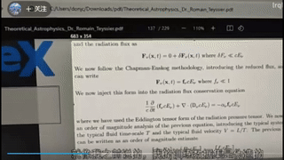
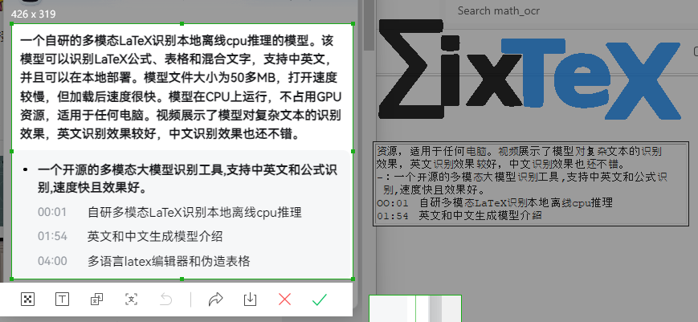

# MixTeX - Multimodal LaTeX OCR with CPU Inference
[](https://arxiv.org/abs/2406.17148) 
<a href="https://colab.research.google.com/github/RQLuo/MixTeX/blob/main/MixTex_Demo.ipynb" target="_parent"></a>
[](https://huggingface.co/MixTex/ZhEn-Latex-OCR)
[](https://www.youtube.com/watch?v=PqQdQ5xT-vk)

## Online Demo: https://mineai.top/

MixTeX is an innovative multimodal LaTeX recognition mini-program, independently developed by our team. It performs efficient CPU-based inference in a local offline environment. Whether it's LaTeX formulas, tables, or mixed text, MixTeX can easily recognize them all, supporting both Chinese and English processing. Thanks to powerful technical support and optimized design, MixTeX can run efficiently without GPU resources, suitable for any Windows computer, greatly facilitating user experience.


## Key Features

- **LaTeX Formula Recognition**: Accurately recognizes complex LaTeX mathematical formulas, ensuring mathematical expression accuracy.
- **Table Recognition**: Efficiently processes and recognizes various tables, generating corresponding LaTeX table code.
- **Mixed Text Recognition**: Simultaneously processes text containing words, formulas, and tables, guaranteeing completeness and accuracy of recognition results.
- **Bilingual Support**: Whether Chinese or English, MixTeX achieves high-precision recognition, meeting needs in different language environments.

## Technical Characteristics

- **Local Offline Inference**: No internet connection required, ensuring data privacy and security, suitable for high-confidentiality user scenarios.
- **Lightweight Design**: The program startup file is only about 50 MB, facilitating quick deployment and startup.
- **Efficient Operation**: Although the model file size is 300 MB, causing a slightly slower startup, once loaded, it runs extremely fast, ensuring a smooth user experience.
- **No GPU Required**: Runs efficiently on CPU, suitable for all Windows computers without the need for high-end hardware support.

## User Guide

1. **Clipboard Image Recognition**: Users can enable the clipboard function by pressing `Win+V` and copy the image to be recognized to the clipboard.
2. **Screenshot Recognition**: Use the built-in Windows screenshot tool or the screenshot key on the keyboard to capture and directly recognize the screenshot content.

## User

As a permanently free software, MixTeX promises continuous optimization while maintaining local offline operation, with no advertisements, providing the best user experience. 

## Demo

MixTeX excels in recognizing complex text, with particularly good performance in English recognition and comparable results for Chinese. The following image demonstrates MixTeX's recognition capabilities for complex text: (Recommended Image size: 400 x 500)






## Environment Requirements

MixTeX uses LaTeX environment for code conversion. We recommend the following LaTeX configuration:

```latex
\documentclass{ctexart}
\usepackage{amssymb}
\usepackage{amsmath}
\usepackage{stmaryrd}
\usepackage{color}
```

## Changelog

~~During usage, you may encounter the following warning message: `Error during OCR: Invalid image type. Expected either PIL.Image.Image, numpy.ndarray, torch.Tensor, tf.Tensor or jax.ndarray, but got <class 'list'>.`~~

v1.0.1 [Resolved] **Critical**: Unable to copy files while running the software, and copying files caused warnings.

~~Consistent warning message: `Error during OCR: Unable to infer channel dimension format.`~~

v1.0.2 [Resolved] **Extreme**: Some users' monitors are too advanced, with non-RGB colors, causing the software to be unusable.

v1.1.2 [Optimization] Added data collection function, fine-tuned 300 real small samples, optimized curly bracket and table recognition. More tables and formulas have been added for pre-training, including the formulas provided by @github.com/ZLab511

v2.1.2 [Upgrade] Synthesized handwriting dataset, fine-tuned 100 real manuscripts, retrained the model, and partially supported handwritten text mixed formula.
v2.2.3 [Upgrade] Fine-tuned 150 real manuscripts + 300, and supported handwritten text mixed formula and black background.

## Limitations

Currently, MixTeX only supports recognition of clear printed fonts for Chinese and English mixed formulas and relatively simple tables. We plan to expand our capabilities in future updates:

- Support for handwritten formulas and text recognition
- Multi-language support
- Complex table recognition

It's important to note that our model's training dataset is largely synthetic and generated, which results in somewhat rough, uniform, and limited data. In future iterations, we will gradually enhance and expand our training dataset with real-world scenarios. This improvement will lead to better recognition accuracy and increased robustness of the system.

We appreciate your understanding as we continue to develop and refine MixTeX. Your feedback and patience are invaluable as we work towards creating a more comprehensive and versatile tool.

## Conclusion

MixTeX is committed to providing users with the most convenient and efficient multimodal LaTeX recognition tool. We look forward to your use and feedback. If you have any suggestions or encounter any issues with MixTeX, please feel free to contact us. Let's work together to create the best LaTeX recognition tool!


